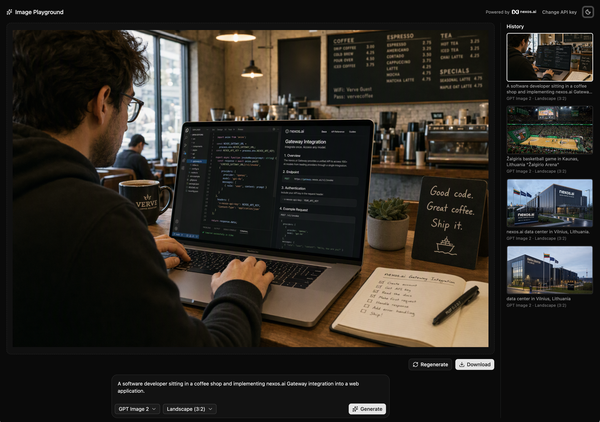

# nexos.ai Image Playground

A small, open-source demo app that generates images with the [nexos.ai](https://nexos.ai/) Gateway API. Type a prompt, pick a model and a size, and generate. Generated images are kept in a local history so you can come back to them, download them, or delete them.

It runs entirely in the browser: there is no backend. Your API key and your images are stored only on your device (localStorage and IndexedDB).



## Getting a nexos.ai API key

1. Go to the [API keys page](https://workspace.nexos.ai/gateway/api-keys).
2. Click **Generate API key**, give it a name (e.g. "Image Playground"), then click **Generate**.
3. Copy the key and paste it into the app when it asks for it.

## Running locally

Requires Node.js and [pnpm](https://pnpm.io/).

```sh
pnpm install
pnpm dev
```

Other scripts: `pnpm build` (type-check and production build), `pnpm preview` (serve the build), `pnpm lint`.

## Where the nexos.ai code lives

All the code that talks to nexos.ai is in one file: [`src/lib/nexos-api.ts`](src/lib/nexos-api.ts). It is written to be read. It explains the Gateway, shows the equivalent `curl` calls, and covers:

- **`listImageModels()`**: `GET /models`, filtered to the models that support image generation.
- **`generateImage()`**: `POST /images/generations`, including decoding base64 responses and downloading URL responses.
- **`NexosApiError`**: error handling (e.g. 401/403 for a rejected key).

The nexos.ai Gateway is OpenAI-compatible, so if you already use the OpenAI API, switching mostly means changing the base URL to `https://api.nexos.ai/v1` and using your nexos.ai key.

Everything else is ordinary app code: the UI (`src/components/`), preferences (`src/lib/prefs.ts`) and the local image history (`src/lib/db.ts`, `src/lib/generations.ts`).

## A note on API keys

This demo calls the API straight from the browser with the user's own key, which is fine for a bring-your-own-key tool. If you build a product where *you* pay for usage, don't put your key in front-end code. Make the calls from your backend and keep the key there.

## Tech stack

Vite, React 19, TypeScript 7, Tailwind CSS v4, shadcn/ui (Base UI), Dexie (IndexedDB) and Lucide icons.

## License

[MIT](LICENSE) © Nexos B.V.
